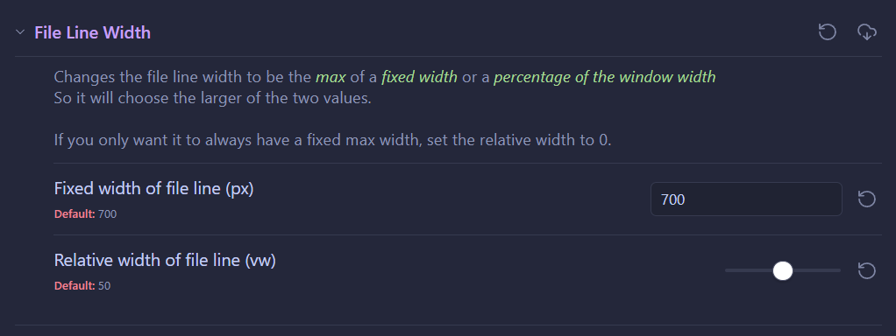

# Obsidian-Snippets
Just thought it might be interesting to upload my snippets to GitHub

These snippets might require the Style Settings plugin

---

# [File Line Width](https://github.com/Rothinnpanna/obsidian-snippets/blob/main/snippets/file-line-width.css)

This is for if you're using the "Readable line length" setting. 
It changes the "--file-line-width" variable that controls the max-width of the document. So that instead of just being a fixed width in pixels, it will choose the larger between a fixed width and a percent of the width of the window.

These values are then editable with the Style Settings plugin:

---
